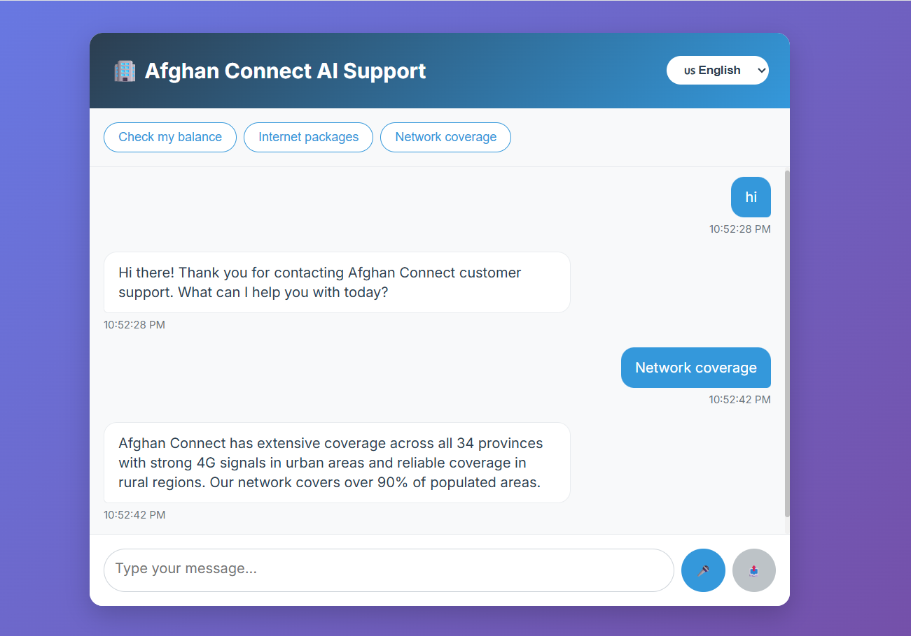
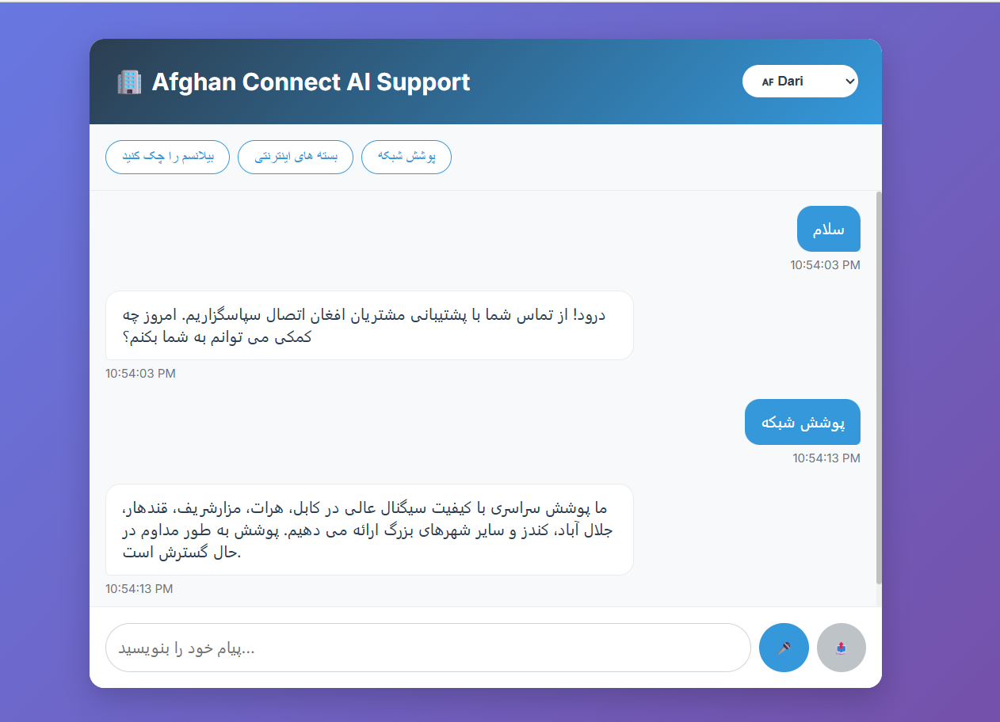
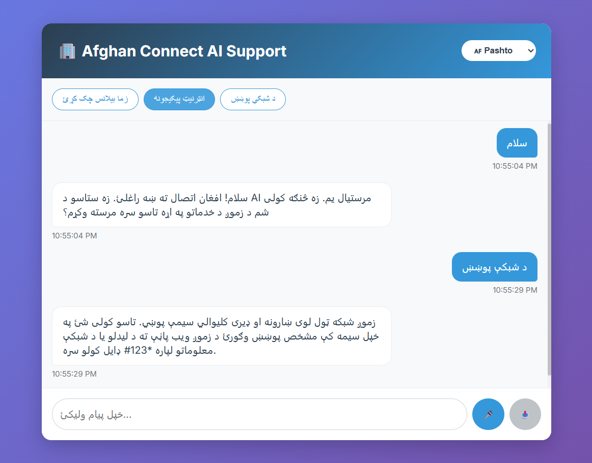

🌐 Telecom Multilingual AI Customer Support Agent

A full-stack AI-powered customer assistant with multilingual + voice capabilities.

      

📸 Screenshots

    

🚀 Overview

This project is a Telecom AI Customer Support Agent that provides human-like assistance in English, Dari, and Pashto.
It simulates a telecom service experience, handling:

✔ Balance inquiries
✔ Internet package lists
✔ SIM registration guidance
✔ Network troubleshooting
✔ Voice-enabled conversations

The system is fully modular and perfect for telecoms, customer service automation, or AI-driven support systems.

✨ Key Features
🤖 AI & Language

Multilingual support (EN / Dari / Pashto)

Uses LLM API (DeepSeek/OpenAI compatible)

NLP-based intent handling

Voice-to-text and text-to-speech

🧠 Telecom Simulation

Fake customer database

Coverage & SIM registration FAQs

Package & balance lookup

🖥️ Frontend (React + Vite)

Real-time chat UI

Modern responsive design

Microphone & speaker integration

🛠 Backend (Django REST Framework)

REST APIs for telecom data

LLM integration

Structured responses

🛠️ Tech Stack
Layer	Technologies
Frontend	React, Vite, CSS3, Web Speech API
Backend	Django, DRF, Python
AI	DeepSeek API / OpenAI compatible
Tools	Git, VS Code, Virtualenv
⚡ Quick Start Guide
🔧 Backend Setup
cd backend
python -m venv venv
source venv/bin/activate       # Windows: venv\Scripts\activate
pip install -r requirements.txt
python manage.py migrate
python manage.py runserver

🎨 Frontend Setup
cd frontend
npm install
npm run dev

Then open:
👉 http://localhost:3000

📌 Future Improvements

Add avatar-style AI assistant

Add real telecom databases

Deploy backend/ frontend online

JWT authentication

WhatsApp / Telegram bot support

⭐ Star This Repo

If you like this project or want to support more AI projects:

👉 Please give it a ⭐ on GitHub — it motivates a lot!

🤝 Contributing

Pull requests are welcome.
For major changes, please open an issue first.

📜 License

This project is open-source under the MIT License.
