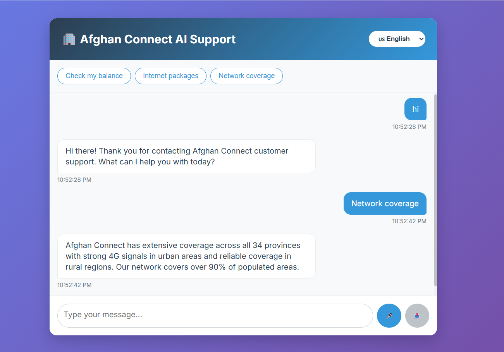
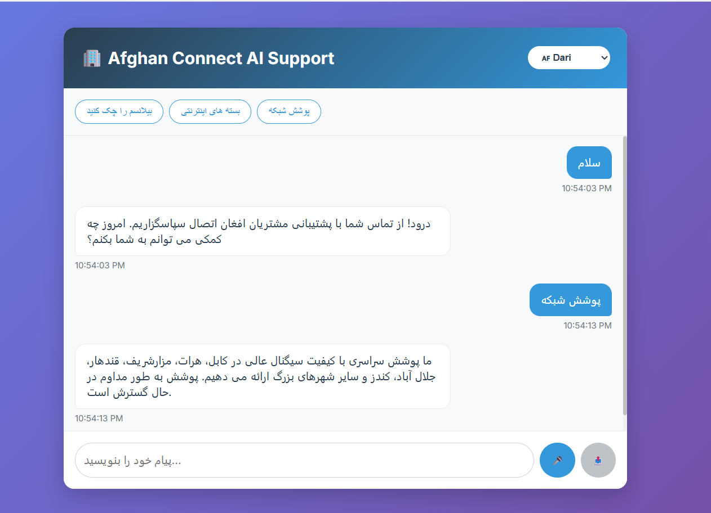
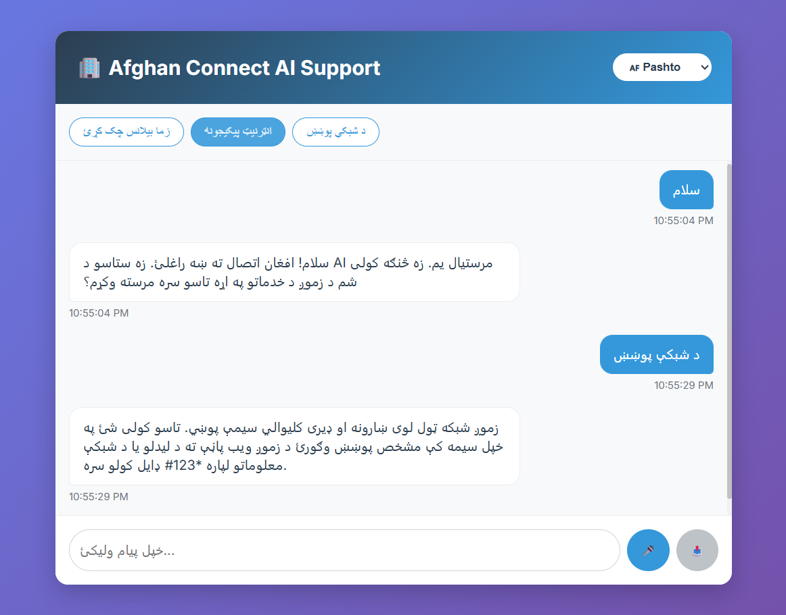

# 🌐 Telecom Multilingual AI Customer Support Agent

A full-stack AI-powered telecom customer assistant with **multilingual support** (English / Dari / Pashto), **voice capabilities**, **RAG-powered responses**, and a **full admin management panel**.

<p align="center">
  
  
  
  
  
  
</p>

## 📸 Screenshots

<p align="center">
  
  
  
</p>

## 🚀 Overview

This project is a Telecom AI Customer Support Agent that provides human-like assistance in **English**, **Dari**, and **Pashto**. It simulates a telecom service experience for **Afghan Connect**, Afghanistan's first communications company.

The system uses **Retrieval-Augmented Generation (RAG)** to pull real data from the database — internet packages, coverage areas, FAQs, and knowledge base entries — and delivers natural, conversational responses. It supports **three AI providers** (Mock, DeepSeek, OpenAI) with runtime switching via the admin panel.

### Core Capabilities

- ✔ Balance inquiries & account management
- ✔ Internet package listings & subscriptions
- ✔ SIM registration guidance
- ✔ Network coverage lookups (province/city level)
- ✔ Network troubleshooting & technical support
- ✔ Voice-enabled conversations (Web Speech API + OpenAI TTS)
- ✔ Full voice mode (speak → AI responds → listens again — like ChatGPT voice)
- ✔ Admin panel for managing all telecom data

## ✨ Key Features

### 🤖 AI & Language
- **Multilingual support**: English, Dari (فارسی دری), Pashto (پښتو)
- **Three AI providers** switchable at runtime:
  - **Mock AI** (default, no API key required) — RAG-powered with natural conversational templates
  - **DeepSeek API** — real AI with RAG context injection
  - **OpenAI API** (GPT-4o-mini) — real AI with RAG context injection
- **RAG (Retrieval-Augmented Generation)** — TF-IDF vector search across all telecom data models
- **Intent detection** — NLP-based routing (greeting, balance, package, coverage, sim, technical)
- **Conversational responses** — natural paragraphs, no bullet points, ChatGPT-like style

### 🎤 Voice Capabilities
- **Speech-to-text** via Web Speech API (browser microphone input)
- **Text-to-speech** via browser SpeechSynthesis API (all languages)
- **OpenAI TTS API** for high-quality Dari/Pashto speech (when configured)
- **Voice Mode** — full conversational loop: listen → respond → listen again
- **Animated voice visualizer** — pulsing orb with listening/speaking states
- **Smart voice fallback** — API TTS for non-English, browser TTS for English

### 🧠 Telecom Simulation
- **Internet Packages** — name, price (AFN), data amount, validity, activation USSD codes
- **Coverage Areas** — province/city level with 2G/3G/4G/5G types and status (active/planned/maintenance)
- **Technical Support FAQs** — categorized (network, device, billing, account) with publish/draft control
- **Knowledge Base** — categorized entries (balance, packages, coverage, sim, technical)
- **Seed data** — pre-populated with realistic Afghan telecom data

### 🖥️ Frontend (React + Vite)
- Real-time chat UI with typing indicators
- Language selector (EN / Dari / Pashto) with flag indicators
- Quick action buttons for common queries (localized per language)
- Voice input button with recording state
- Voice mode toggle for hands-free conversational experience
- Animated voice visualization overlay
- Read-aloud button on each AI response
- Responsive design with modern UI

### 🛠 Backend (Django REST Framework)
- REST APIs for all telecom data models
- Session-based conversation tracking
- RAG service with TF-IDF (scikit-learn) or keyword fallback
- Auto-fallback between AI providers
- Comprehensive logging (console + file)

### 🔐 Admin Panel (Full CRUD + Dashboard)
- **Dashboard** with statistics (conversations, messages, packages, coverage, FAQs, KB)
- **Internet Packages** management — create, edit, delete, activate/deactivate
- **Coverage Areas** management — province, city, network type, status
- **Technical Support FAQs** management — categorized, publish/draft toggle
- **Knowledge Base** management — multilingual Q&A entries
- **Settings** — runtime AI provider switching (Mock / DeepSeek / OpenAI)
- **API Key management** — securely stored in database, masked in UI
- **Token-based authentication** — login/logout with persistent sessions
- **Default credentials**: `admin` / `admin123`

### 🗣️ Text-to-Speech (API-based)
- **OpenAI TTS** integration for high-quality Dari and Pashto speech
- TTS status endpoint to check availability
- Automatic fallback to browser SpeechSynthesis when API unavailable
- Voice mapping optimized per language (nova for English, alloy for Dari/Pashto)

## 🛠️ Tech Stack

| Layer       | Technologies                                      |
|-------------|---------------------------------------------------|
| Frontend    | React 18, Vite, CSS3, Web Speech API, Axios       |
| Backend     | Django 4.2, Django REST Framework, Python         |
| AI Providers| Mock AI (built-in), DeepSeek API, OpenAI API      |
| RAG Engine  | scikit-learn (TF-IDF + cosine similarity)         |
| TTS         | OpenAI TTS API, Web Speech API (SpeechSynthesis)  |
| Auth        | DRF Token Authentication                          |
| Database    | SQLite (development), Django ORM                  |
| Tools       | Git, VS Code, Virtualenv                          |

## 📁 Project Structure

```
├── backend/
│   ├── ai_agent/
│   │   ├── management/commands/
│   │   │   └── seed_data.py          # Database seeder with realistic telecom data
│   │   ├── migrations/               # Django database migrations
│   │   ├── services/
│   │   │   ├── ai_service.py         # DeepSeek API integration (primary)
│   │   │   ├── deepseek_service.py   # Alternative DeepSeek client
│   │   │   ├── mock_ai_service.py    # RAG-powered mock service (default, no API key)
│   │   │   ├── openai_service.py     # OpenAI API integration (GPT-4o-mini)
│   │   │   └── rag_service.py        # RAG engine: TF-IDF retrieval + intent detection
│   │   ├── admin.py                  # Django admin configuration
│   │   ├── models.py                 # All data models (6 models)
│   │   ├── serializers.py            # DRF serializers for all models
│   │   ├── urls.py                   # API route definitions (18 endpoints)
│   │   └── views.py                  # All API endpoint implementations
│   ├── telecom_ai/
│   │   ├── settings.py               # Django settings (CORS, auth, logging)
│   │   └── urls.py                   # Root URL configuration
│   ├── .env                          # Environment variables (API keys)
│   ├── db.sqlite3                    # SQLite database (development)
│   └── requirements.txt
├── frontend/
│   ├── src/
│   │   ├── components/
│   │   │   ├── ChatInterface.jsx     # Main chat UI with voice capabilities
│   │   │   ├── ChatInterface.css     # Chat styles
│   │   │   ├── AdminPanel.jsx        # Full admin CRUD panel (6 tabs)
│   │   │   ├── AdminPanel.css        # Admin panel styles
│   │   │   ├── Login.jsx             # Admin login page
│   │   │   └── Login.css             # Login page styles
│   │   ├── App.jsx                   # Root app with routing (chat + admin)
│   │   ├── App.css                   # App-level styles
│   │   ├── index.css                 # Global styles
│   │   └── main.jsx                  # Entry point
│   ├── index.html
│   ├── package.json
│   └── vite.config.js
└── Pictures/
    ├── English.png
    ├── Dari.png
    └── Pashto.png
```

## 📡 API Endpoints

| Endpoint                          | Method(s)       | Auth Required | Description                          |
|-----------------------------------|-----------------|---------------|--------------------------------------|
| `/api/chat/`                      | POST            | No            | Send a message, get AI response      |
| `/api/voice-chat/`                | POST            | No            | Voice chat with transcribed text     |
| `/api/health/`                    | GET             | No            | Health check with AI service status  |
| `/api/admin/login/`               | POST            | No            | Admin authentication (returns token) |
| `/api/admin/stats/`               | GET             | Yes           | Dashboard statistics                 |
| `/api/admin/settings/`            | GET, POST       | Yes           | Get/update AI provider & API keys    |
| `/api/admin/knowledge-base/`      | GET, POST       | Yes           | List/create KB entries               |
| `/api/admin/knowledge-base/:id/`  | GET, PUT, DELETE| Yes           | Retrieve/update/delete KB entry      |
| `/api/admin/packages/`            | GET, POST       | Yes           | List/create internet packages        |
| `/api/admin/packages/:id/`        | GET, PUT, DELETE| Yes           | Retrieve/update/delete package       |
| `/api/admin/coverage/`            | GET, POST       | Yes           | List/create coverage areas           |
| `/api/admin/coverage/:id/`        | GET, PUT, DELETE| Yes           | Retrieve/update/delete coverage area |
| `/api/admin/faqs/`                | GET, POST       | Yes           | List/create technical FAQs           |
| `/api/admin/faqs/:id/`            | GET, PUT, DELETE| Yes           | Retrieve/update/delete FAQ           |
| `/api/tts/status/`                | GET             | No            | Check TTS API availability           |
| `/api/tts/speak/`                 | POST            | No            | Generate speech audio (OpenAI TTS)   |

## ⚡ Quick Start Guide

### 🔧 Backend Setup

```bash
cd backend
python -m venv venv
# Windows:
venv\Scripts\activate
# Linux/Mac:
# source venv/bin/activate
pip install -r requirements.txt
python manage.py migrate
python manage.py seed_data
python manage.py runserver
```

### 🎨 Frontend Setup

```bash
cd frontend
npm install
npm run dev
```

Then open:
👉 **http://localhost:3000**

### 🔐 Admin Panel Access

1. Create a superuser:
```bash
cd backend
python manage.py createsuperuser
# Username: admin
# Email: (leave blank)
# Password: admin123
```

2. Navigate to **http://localhost:3000/admin**
3. Login with your credentials (default: `admin` / `admin123`)

### 🧪 Testing the API

Once the backend is running, test the health endpoint:

```bash
curl http://localhost:8000/api/health/
```

Expected response:
```json
{
  "status": "healthy",
  "service": "Telecom AI Agent API",
  "ai_service": "healthy",
  "ai_provider": "mock",
  "version": "1.1.0",
  "message": "RAG-powered AI service retrieving real data from database"
}
```

Test the chat endpoint:

```bash
curl -X POST http://localhost:8000/api/chat/ \
  -H "Content-Type: application/json" \
  -d '{"message": "What internet packages do you have?", "language": "en"}'
```

### 🌱 Seeding Database with Telecom Data

```bash
cd backend
python manage.py seed_data
```

This populates the database with:
- 5 knowledge base entries (balance, SIM, technical, coverage)
- 5 internet packages (Basic, Standard, Premium, Super, Night)
- 12 coverage areas across Afghan provinces
- 5 technical support FAQs (network, device, billing, account)

## 🔑 Using Real AI Providers

### DeepSeek API

1. Get an API key from [DeepSeek Platform](https://platform.deepseek.com/)
2. Update [`backend/.env`](backend/.env):
   ```
   DEEPSEEK_API_KEY=your-actual-api-key-here
   ```
3. The backend will automatically use the real DeepSeek AI service

### OpenAI API

1. Get an API key from [OpenAI Platform](https://platform.openai.com/)
2. Update [`backend/.env`](backend/.env):
   ```
   OPENAI_API_KEY=your-actual-api-key-here
   ```
3. Or configure it at runtime via the Admin Panel → Settings tab

### Switching Providers at Runtime

1. Login to the Admin Panel at **http://localhost:3000/admin**
2. Go to **Settings** tab
3. Select your preferred AI provider (Mock / DeepSeek / OpenAI)
4. Enter the corresponding API key (if applicable)
5. Click **Save Settings** — the AI service reinitializes immediately

## 🧠 How RAG Works

The [`RAGService`](backend/ai_agent/services/rag_service.py) uses **TF-IDF vectorization** (via scikit-learn) to find relevant telecom data from the database:

1. **Intent Detection** — analyzes the user query to determine intent (greeting, balance, package, coverage, sim, technical, default)
2. **Multi-source Retrieval** — searches across Knowledge Base, Internet Packages, Coverage Areas, and FAQs
3. **Relevance Ranking** — ranks results by TF-IDF cosine similarity (or keyword overlap fallback)
4. **Localized Results** — returns content in the user's language (EN/Dari/Pashto) with English fallback
5. **Context Injection** — feeds retrieved context into the AI prompt for natural, data-grounded responses

When using **Mock AI**, the RAG context is formatted into natural conversational templates. When using **DeepSeek** or **OpenAI**, the context is injected into the system prompt for ChatGPT-like responses.

## 📊 Data Models

| Model                    | Fields                                                                 |
|--------------------------|------------------------------------------------------------------------|
| `Conversation`           | session_id, user_language, created_at, updated_at                      |
| `Message`                | conversation (FK), content, is_user, intent, confidence, created_at    |
| `TelecomKnowledgeBase`   | question_en/dari/pashto, answer_en/dari/pashto, category, created_at   |
| `InternetPackage`        | name_en/dari/pashto, price_afn, data_amount, validity_days, descriptions, activation_code, is_active |
| `CoverageArea`           | province, city, coverage_type (2G-5G), status, notes_en/dari/pashto   |
| `TechnicalSupportFAQ`    | category, question_en/dari/pashto, answer_en/dari/pashto, is_published |
| `AppConfig`              | key, value, updated_at (for runtime settings)                          |

## 📌 Future Improvements

- [ ] Add avatar-style AI assistant
- [ ] Connect to real telecom databases/APIs
- [ ] Deploy backend/frontend to production
- [ ] JWT authentication (beyond token-based)
- [ ] WhatsApp / Telegram bot integration
- [ ] Real-time WebSocket chat
- [ ] Analytics dashboard with charts
- [ ] SMS/USSD gateway integration

## ⭐ Star This Repo

If you like this project or want to support more AI projects:

👉 **Please give it a ⭐ on GitHub** — it motivates a lot!

## 🤝 Contributing

Pull requests are welcome. For major changes, please open an issue first to discuss what you'd like to change.

## 📜 License

This project is open-source under the MIT License.
